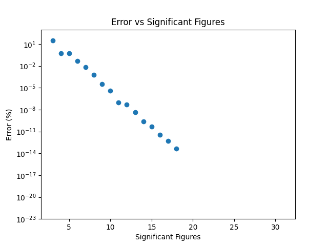
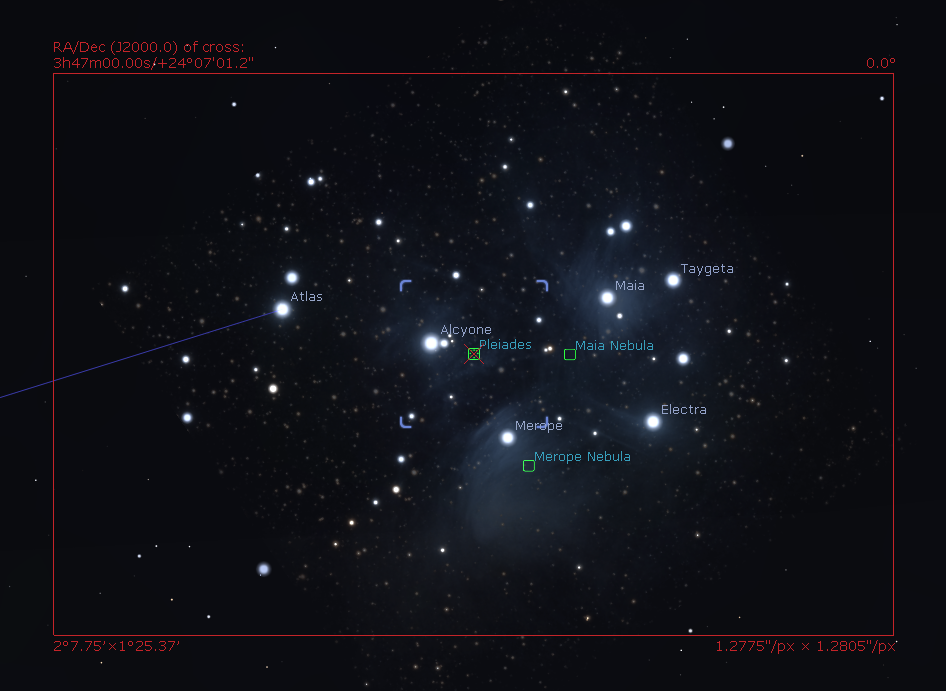

# Moving Around

How fast do we need to spin our camera around?
Quite simple, as fast as the earth spins!
But how fast does the earth spin?
About 24 hours.
Is that accurate enough?
Probably not.

## The Rotation of the Earth

As our planet tries to keep the sun at an arm's length (it's got quite the fiery temper), it also twirls around it's rotational axis.
It does this every 86,164.0905 seconds, that is 23 hours, 56 minutes and 4.0905 seconds ([thanks Wikipedia!](https://en.wikipedia.org/wiki/Sidereal_time)).
It's worth mentioning that this is in relation to the stars, where as [solar time](https://en.wikipedia.org/wiki/Solar_time) is what we know as the standard 24 hour day (and even that is somewhat inaccurate as the earth orbits the sun!).
The rotation relative to the stars is known as sidereal time.
This is the time we need to use to calculate our desired RPM.

Let's first convert from seconds to minutes:

    86164.0905 / 60 = 1,436.068175

Now that we have the period, we can convert it to frequency:

    1 / 1,436.068175 = 6.9634577063167631299955519173036e-4 rpm

Eesh, that's a lot of significant figures for a very small value.
How much of these do we actually need?

The mathematically inclines among us are probably already able to estimate the rough numbers, but it's always nice to get confirmation.

Let's do some math.

```python
import matplotlib.pyplot as plt

significant_number = 6.9634577063167631299955519173036e-4
sig_figs = [x for x in range(3, 32)]
error = []

for s in sig_figs:
    rounded = round(significant_number, s)
    # Rounding errors at these scales can cause negative numbers
    err = abs((1.0 - (significant_number / rounded)) * 100.0)
    error.append(err)

plt.scatter(x=sig_figs, y=error)
plt.title("Error vs Significant Figures")
plt.xlabel("Significant Figures")
plt.ylabel("Error (%)")
plt.yscale("log")
plt.ylim(10e-24, 1000.0)
plt.show()
```

<div style="text-align:center">

<p>The error (in %) versus the amount of significant figures, note the plot ending at about 16 figures, this is where Python gave up</p>
</div>

In table form:

| Rounded Value | Error|
| -----------: | :--- |
| 0.001 | 30.365422936832363% |
| 0.0007 | 0.5220327669033797% |
| 0.00070 | 0.5220327669033797% |
| 0.000696 | 0.04967968845923654% |
| 0.0006963 | 0.006573406818377592% |
| 0.00069635 | 0.0006073624360780627% |
| 0.000696346 | 3.293884415223047e-05% |
| 0.0006963458 | 4.217491311742094e-06% |
| 0.00069634577 | 9.071303708196865e-08% |
| 0.000696345771 | 5.2893789348473774e-08% |
| 0.0006963457706 | 4.548939003257146e-09% |
| 0.00069634577063 | 2.4071855619922644e-10% |
| 0.000696345770632 | 4.647393581080905e-11% |
| 0.0006963457706317 | 3.397282455352979e-12% |
| 0.00069634577063168 | 5.329070518200751e-13% |
| 0.000696345770631676 | 4.440892098500626e-14% |

Further entries omitted because the values became too small for my Python script to handle.

With this knowledge, we need to set a reasonable error measure.
If we are shooting with an [APS-C](https://en.wikipedia.org/wiki/APS-C) sensor and a 600mm lens, which would probably be the longest lens someone would reasonably want to use (or could afford!).
If we plug this into [Stellarium](https://stellarium.org/en_GB/), a tool that lets you explore the night sky at your location, we arrive at an angular width of a little more than 2 degrees, and an angular height of about 1.5 degrees.
That seems like a respectable goal. Staying under this would mean that you could, in theory track an object over the course of at least a sidereal day without adjusting.

<div style="text-align:center">

<p>Screenshot of Stellarium, with the angular dimensions of the image on the bottom left.</p>
</div>

If we can stay under a 1 degree drift per 24 hours, we'll already have a very accurate tracker.
This would work out to about a

`(1 / 360) * 100 = 0.28% error`

Is this attainable?
If we look back at our table, we can see that if we use a value of `6.96e-3` we would already be at an error of 0.05% or

`(x / 360) * 100 = 0.05%`

`x / 360 = 0.0005`

`x = 0.18 degree error`

per 24 hours.

Adding one more significant figure boosts us to a 0.02 degree error, but we should be careful to not fall into the trap of overextending our goals.
Fortunately, changing the amount of significant figures is a firmware detail, and should be relatively easily adapted, depending on our hardware.

## Hardware

Speaking of hardware, we should start looking at what kind of motors we can get.
Mainly, we should select on accuracy.
It would be a shame if we spent all that time calculating our desired output RPM, and it turns out that our motor selection causes it to drift!

### DC Motors

The simplest motors you can find are probably the [DC motors](https://en.wikipedia.org/wiki/DC_motor).
They take a free-spinning magnetic core and give it motion by enabling and disabling electromagnets in a certain fashion.
These are often found in RC cars and drones to drive the wheels or propellers.
We'll spare you the exact details how they work, but the gist is, zappy stuff in, spinny stuff out.
The zappier the stuff, the spinnier the out, untill the motor eventually melts.

Now, generally these motors have a certain RPM at a certain voltage.
However, unless you spend a reasonable amount of money on one, the exact RPM is not guaranteed.
As you increase the amount of load (i.e.: More weight) on the motor, the RPM at the same voltage may change.
This is not as large an issue for most applications, and there are ways to accurately control the RPM through some clever circuitry.
However, we feel it's simpler to use a stepper motor instead.

### Stepper Motors

[Stepper motors](https://en.wikipedia.org/wiki/Stepper_motor) are also DC motors, with the advantage that it divides a full rotation in equal steps.
Through a certain magnet geometry the output of the shaft can be rotated by a specific amount each time an electromagnet is turned on or off.
Now, the motor does not know _where_ it is pointing, all it knows is where it is going.

<div style="text-align:center">

<p>Animation that shows how a stepper motor works. As each electromagnet is turned on the center magnet moves by a set amount. Wapcaplet/Teravolt, 2010</p>
</div>

This has the advantage that, knowing how many steps each rotation takes, you can be very accurate with your positioning.
The lack of information about your current angle can be mitigated with external solutions, or in some cases, you don't even need to know.
3D Printers make wide use of stepper motors to move their print heads around, to great results.

The downside to stepper motors is that they, well, step.
Ideally we would get a smooth motion to match the stars' movement instead of the slightly jittery movement that is inherent in stepper motors.

### Servo

It would be a miss if we didn't mention [servo motors](https://en.wikipedia.org/wiki/Servomotor).
Servo motors differ from the previous two in that it knows exactly where it is pointing and where it needs to be.
If you tell the motor to point at 90 degrees it will figure out how to get there by taking the difference between it's current position and the target position and using it as an error signal to correct with.
Unfortunately, the drawback is that a servo is only as good as it's position encoder, and cheaper servos don't have very accurate encoders.
Not to say that they are wildly inaccurate for their intended purpose, they just probably won't be accurate enough for our purpose.

### Weapon of Choice

All these motors have their own benefits and drawbacks.
Nevertheless, the easiest choice would be the stepper motor.
With the amount of steps being known, we can have a very fine control over the RPM by stepping at a certain rate.
The jitter of the steps should also be reduced if we take a stepper with a sufficiently high amount of steps per revolution.
Additionally, none of the motors (at hobbyist prices) described can reliable rotate at an RPM of 0.000696 rpm.
We'll definately need to use some form of gearbox to reduce the output of the motor, further decreasing the effect of the steps on the photos.
