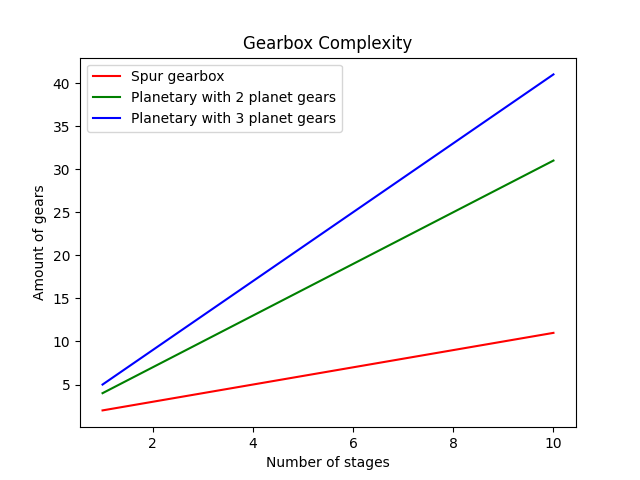

# Gearheads

As we discussed, existing hobby grade motors probably won't be able to rotate at the desired 0.000696 RPM.
We'll need to design a gearbox that can take a higher RPM from the motor, and bring it down to the lower RPM.
Now, gearboxes are a whole can of worms we're going to open.

## The gear

_The Gear._
This little invention that you can [track back thousands of years](https://en.wikipedia.org/wiki/Gear#History) and is still in use today.
From gearboxes in cars to mechanical clocks to cameras and more!
The idea of a gear is that it interlocks with a similar object, and through it's rotation imparts a movement.
Gear ratios, the ratio of the amount of teeth between two or more gears, have the added benefit that they can increase or decrease the amount of torque, at the benefit or cost of rotational speed respectively.

Gears rotating. The smaller gear has a larger rotational velocity to keep up with the larger gear, Simiprof, 2013.

Now, these things have been around for so long, that humans have tried a lot of things with them, and their design.
Equally ubiquitous are terms for describing very specific parts of the gear.
We won't be going into detail on these.
But we'll have warned you, lest we make a mechanical engineer very sad.

Terminology used to describe the anatomy of a gear, Honaroog, 2007.

So what about these ratios?
This is pretty simple, really.
If you take the amount of teeth of one gear, and divide it by the amount of teeth on the other gear, you get the gear ratio.
For example: gear A has 10 teeth, and we interface it with gear B with 100 teeth.
In order for gear A to completely rotate gear B, it needs to rotate 10 times to "visit" the 100 teeth of gear B.
Ergo, the gear ratio here is 10 : 1.
10 rotations cause 1 rotation.
The reverse is also true, if we take gear B as our input gear now, every rotation of gear B causes 10 rotations of gear A.
This gear ratio is 1 : 10.
Some people like to use decimal numbers to indicate their ratios, such as 0.1 : 1.
Mainly for less evenly dividable values, such as 23 : 31 to 1 : 1.347.
This is purely a matter of preference, but the end results are the same.

### I like the cut of your ~~jib~~ Gear

Gears can come in a few shapes and sizes, as we've discussed, but they can also come in different cuts.
A cut determines how the teeth are shaped around the axis of rotation.
The most well know cuts are the [straight cuts](https://en.wikipedia.org/wiki/Gear#Spur) (also known as spur gear).
These are what you would picture if you think "gear".
The other popular cut would be the [helical gear](https://en.wikipedia.org/wiki/Gear#Helical).
These have their gears twist around the rotational axis in a, well, helix.
A variation on the helical gear is the double helical, these will switch the direction of their twist halfway along the gear's width.

The main benefit of a straight cut is the larger contact area between two gears.
This allows for a larger change in force application.
Unfortunately, they tend to be somewhat noisy at high speeds.
Their efficiency and simple construction makes them preferable in racing gear boxes, for example.

Helical gears are smoother than the straight cut gears, because they grow and shrink their contact surface gradually as the teeth interact.
You'll find these a lot in you car's gearbox, or other applications where high RPM and low noise are desired.
Downside of them is that they impart a force along the rotational axis, reducing the efficiency, and requiring some measures to counter this thrust.

The double helical gear aims to negate the axial load by doubling up on the helical direction, one half goes one way, the other one goes the other.
These have the benefit of the smooth contact patch provided by the helical gear while generating a net zero lateral force.
This makes them interchangeable with straight cut gears, but substantially more complex to manufacture.

Differently cut gears. Green is the straight cut, purple is the helical cut and orange is the double helical cut, BavariaSHAPE, 2020

As we're not dealing with a high RPM application, the exact type of gear should not matter too much.
Helical gears are nice, though, for their increased smoothness.
Double helical gears do the same, but they also look cool.
And why build anything functional while not making it look cool?

There are many, many more gear configurations, but they are not as immediately relevant to our project.

## Metal boxes

Taking a few of these gears, and putting them in a neat little box, is commonly referred to as a gearbox.
Shocker, we know.
But these little (or large) things have been very useful to us.
Gearboxes are used to combine gear ratios into a more useful ratio without having to create very large or very small gears by doing the reductions or increases in several steps.

### Spur gearbox

Spur gearboxes are the simplest combination of gears.
The input gear drives the next, which drives the next, and so on untill you reach the output gear.
Now, the name of this one may imply only straight cut gears are used, but that is not nessecarily true.
It's mainly just the name we could find for it in our internet searches, and we all know that if it's online, it must be true.

They are by far the simplest to design, build and maintain and are as such widely used.
Unfortunately, they also wear a little faster than the planetary gearset, which we'll expand on later.
This is mainly due to the fact that each gear puts full load on the next, which causes stress on the parts and reduces their lifespan.

### Planetary gearset

While stargears are, to the best of our knowledge, not a real thing, sun gears and planetary gears are.
These are found in, get this, planetary gearboxes.
I wonder where they got this term from?
I guess we'll never know.

A planetary gearset. Red is the ring gear, blue are the planetary gears, yellow is the sun gear and green is the carrier, Wapcaplet, 2006

The planetary gearset has a few configurations.
Generally an input and output is defined, and the remaining element is held stationary.
The carrier and planetary gears should be considered part of the same element.
For example: you can take the sun gear as input, and the carrier as output, this would mean that you would need to hold the ring gear stationary
If you want to use the ring gear as output instead, you would have to keep the carrier stationary.

This versatility allows the planetary gearset to be used in various ways at the cost of complexity.
With the spur gearbox, a 10 : 1 reduction requires only 2 gears.
The planetary gearset requires at _least_ 4, preferably 5.
One sun gear, 2 or 3 planetary gears and a ring gear, not to mention the carrier.
If you have to chain several of these reductions, the amount of moving parts increases by a lot.
Additionally, the gears need to be fairly precise, if one planetary gear is slightly out of allignment, it will cause premature wear and failures.
At the cost of this complexity, you gain a lot of reliability and achieve a comparatively smaller footprint for the same reduction.

The amount of gears per stage of reduction for the described gearbox types.

### Worm gears

We would be amiss if we were not to mention the worm gear.
Beloved by engineers and birds alike, this gear uses a screw-shaped gear, the worm gear, and interfaces it with a regular gear, the worm wheel.
Because, generally, a worm gear is one long tooth, you can get a very large reduction in a relatively small package.
For example, if we combine our worm gear with a 100 tooth worm wheel, we get a 100 : 1 reduction.

This is not without issues, though.
The worm gear cannot be back-driven, which means that you can't rotate the output to rotate the input, and the output rotational axis is at an angle from the input, which may make designing a gearbox difficult.
On top of this, the efficiency of a worm gear is not as high as other setups due to the increased friction.

## What does this mean for us?

It's hard to say if using a spur gearbox or a planetary gearset is the best for our purpose.
With our relatively low torque and RPM application, neither's strengths and weaknesses really have an impact.
However, as someone will probably mount their expensive camera to the other end, we'll most likely want the improved reliability of the planetary gearsets.
The increased complexity will have to be a hit we'll take.
